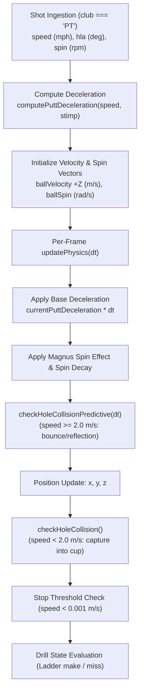

# Putting Practice Mode: Physics Specification & Asset Reference
**Source:** `ShanktuaryGolf/Minigames` (`putting-green.html`)  
**Target Module:** `assets/range/js/putt_physics.js`  
**Task:** SHA-56 (break/elevation removed; flat green)

SHA-56 reduced model (shipped):
- Flat green, `y = 0`. No break, elevation, slope mesh, or grade force.
- Ball fixed at the tee `(0, ballRadius, 0)`. Cup/flag and physics hole at `(0, 0, distanceFt × 0.3048)`.
- GSPro stimp deceleration, straight `+Z` roll, HLA is left/right only.
- Hole capture / lip-out and Magnus spin decay are unchanged.

GSPro coefficient tables in §2 are still live. Break/elevation math is not in SPS.

---

## 1. Executive Summary & Physics Architecture

SPS putting uses GSPro-matched per-putt deceleration, optional Magnus spin decay, and predictive hole-collision detection. Break and elevation were removed in SHA-56.

### Core Architecture Flow


---

## 2. Verbatim Physics Functions & Ground Truth

### 2.1 GSPro Putt Distance & Deceleration Curve
- **Reference File:** `putting-green.html` (Lines 1558–1610)
- **Source Link:** [putting-green.html#L1558-L1610](https://github.com/ShanktuaryGolf/Minigames/blob/main/putting-green.html#L1558-L1610)

The GSPro model maps initial ball speed ($v$ in mph) and green Stimp ($7 \le \text{stimp} \le 14$) to target roll-out distance ($d$ in feet) using quadratic coefficients derived directly from GSPro benchmark tables:
$$d(v) = a \cdot v^2 + b \cdot v + c$$

#### Verbatim Ground-Truth Constants & Functions:
```javascript
// GSPro putting distance coefficients: distance(ft) = a*v² + b*v + c (v in mph)
// Derived from GSPro putting chart — matches every row to <0.1 ft
const GSPRO_PUTT_COEFFS = {
    7:  { a: 0.1296, b: 2.200, c: -4.366 },
    8:  { a: 0.1208, b: 2.715, c: -5.132 },
    9:  { a: 0.112,  b: 3.23,  c: -5.898 },
    10: { a: 0.111,  b: 3.500, c: -6.0   },
    11: { a: 0.1011, b: 3.957, c: -6.481 },
    12: { a: 0.0962, b: 4.263, c: -6.755 },
    13: { a: 0.0979, b: 4.613, c: -7.22  },
    14: { a: 0.0996, b: 4.963, c: -7.685 }
};

function getGSProPuttDistance(speedMPH, stimp) {
    // Interpolate coefficients for the given stimp
    const stimpClamped = Math.max(7, Math.min(14, stimp));
    const stimpLow = Math.floor(stimpClamped);
    const stimpHigh = Math.ceil(stimpClamped);

    let a, b, c;
    if (stimpLow === stimpHigh) {
        const coeff = GSPRO_PUTT_COEFFS[stimpLow];
        a = coeff.a; b = coeff.b; c = coeff.c;
    } else {
        const frac = stimpClamped - stimpLow;
        const lo = GSPRO_PUTT_COEFFS[stimpLow];
        const hi = GSPRO_PUTT_COEFFS[stimpHigh];
        a = lo.a + frac * (hi.a - lo.a);
        b = lo.b + frac * (hi.b - lo.b);
        c = lo.c + frac * (hi.c - lo.c);
    }

    // Low speed fallback: linear from 0 to chart value at 2 mph
    if (speedMPH < 2) {
        const distAt2 = a * 4 + b * 2 + c;
        const safeDist = Math.max(distAt2, 0.1);
        return Math.max(0.1, (safeDist / 2) * speedMPH);
    }

    // Quadratic formula: d = a*v² + b*v + c
    const dist = a * speedMPH * speedMPH + b * speedMPH + c;
    return Math.max(0.1, dist);
}

function computePuttDeceleration(speedMPH, stimp) {
    const distFt = getGSProPuttDistance(speedMPH, stimp);
    const distM = distFt * 0.3048;
    const speedMS = speedMPH * 0.44704;
    // v² = 2*a*d → a = v² / (2*d)
    const decel = (speedMS * speedMS) / (2 * distM);
    console.log(`GSPro putt: speed=${speedMPH.toFixed(1)} mph, stimp=${stimp}, target=${distFt.toFixed(1)} ft, decel=${decel.toFixed(3)} m/s²`);
    return decel;
}
```

---

### 2.2 Stimp Scaling & Theoretical Friction
- **Reference File:** `putting-green.html` (Lines 1533–1556)
- **Source Link:** [putting-green.html#L1533-L1556](https://github.com/ShanktuaryGolf/Minigames/blob/main/putting-green.html#L1533-L1556)

Derived from standard golf physics models (Kolkowitz 2007: deceleration $a = -\frac{5}{7} \rho_g g$):

```javascript
function updateFrictionFromStimp() {
    // Based on Stanford physics paper (Kolkowitz 2007)
    // Deceleration: a = -(5/7) × ρ_g × g
    // Stimpmeter releases ball at 1.83 m/s
    // Fast green (Stimp 12): rolls 3.66m → ρ_g = 0.065
    // Slow green (Stimp 4): rolls 1.22m → ρ_g = 0.196

    // Linear interpolation between slow and fast
    // Stimp range: 7 (slow) to 14 (fast)
    const stimpRange = 14 - 7;
    const rhoGFast = 0.065;
    const rhoGSlow = 0.196;
    const t = (currentStimp - 7) / stimpRange; // 0 = slow, 1 = fast
    const rhoG = rhoGSlow - t * (rhoGSlow - rhoGFast); // Interpolate

    // Deceleration = (5/7) × ρ_g × g
    const deceleration = (5/7) * rhoG * gravity;

    // For our physics update: friction coefficient such that
    // frictionForce = friction × gravity × deltaTime gives correct deceleration
    friction = rhoG * (5/7);

    console.log(`Stimp ${currentStimp} → ρ_g: ${rhoG.toFixed(4)}, Decel: ${deceleration.toFixed(3)} m/s², Friction: ${friction.toFixed(4)}`);
}
```

---

### 2.3 Physics Integration Loop (`updatePhysics`)
- **Reference File:** `putting-green.html` (Lines 1088–1229)
- **Source Link:** [putting-green.html#L1088-L1229](https://github.com/ShanktuaryGolf/Minigames/blob/main/putting-green.html#L1088-L1229)

```javascript
function updatePhysics(deltaTime) {
    if (!isMoving) return;

    // Apply GSPro-matched per-putt deceleration
    const speed = ballVelocity.length();
    if (speed > 0.001) {
        const frictionForce = currentPuttDeceleration * deltaTime;
        const frictionDecel = Math.min(frictionForce / speed, 1);
        ballVelocity.multiplyScalar(1 - frictionDecel);

        // SHA-56: no elevation / break forces. Flat green, friction only.

        // Apply spin effect (Magnus force - simplified)
        if (ballSpin.length() > 0.1) {
            tempSpinEffect
                .crossVectors(ballSpin, ballVelocity)
                .multiplyScalar(0.0001 * deltaTime);
            ballVelocity.add(tempSpinEffect);

            // Spin decay
            ballSpin.multiplyScalar(1 - deltaTime * 2);
        }

        // Check for hole collision BEFORE moving (predictive)
        const hadCollision = checkHoleCollisionPredictive(deltaTime);

        // Update position (only if no collision happened, since collision already positioned the ball)
        if (!hadCollision) {
            ball.position.addScaledVector(ballVelocity, deltaTime);
        }

        // Keep ball on green (simple collision)
        const distFromCenter = Math.sqrt(ball.position.x ** 2 + ball.position.z ** 2);
        if (distFromCenter > 14.8) {
            // Bounce off edge
            tempNormal.set(ball.position.x, 0, ball.position.z).normalize();
            ballVelocity.reflect(tempNormal).multiplyScalar(restitution);
            ball.position.x = tempNormal.x * 14.8;
            ball.position.z = tempNormal.z * 14.8;
        }

        // Check for hole (post-movement for slow balls)
        checkHoleCollision();

        // Update distance to hole display
        updateDistanceToHole();

        // Re-check speed after friction / spin
        const finalSpeed = ballVelocity.length();
        if (finalSpeed < 0.001) {
            ballVelocity.set(0, 0, 0);
            ballSpin.set(0, 0, 0);
            isMoving = false;

            // Check for ladder mode miss
            if (isLadderMode && !puttResultProcessed) {
                puttResultProcessed = true;
                // Ball stopped but didn't go in hole - it's a miss
                setTimeout(() => {
                    ladderPuttMissed();
                    resetBall();
                }, 1500);
            }
        }
    } else {
        // Ball stopped
        ballVelocity.set(0, 0, 0);
        ballSpin.set(0, 0, 0);
        isMoving = false;
        updateDistanceToHole();
    }
}
```

---

### 2.4 Predictive Hole Collision (`checkHoleCollisionPredictive`)
- **Reference File:** `putting-green.html` (Lines 1255–1359)
- **Source Link:** [putting-green.html#L1255-L1359](https://github.com/ShanktuaryGolf/Minigames/blob/main/putting-green.html#L1255-L1359)

Solves ray-circle intersection ahead of the position step for fast balls ($v \ge 2.0\text{ m/s}$) to prevent tunneling across the hole:

```javascript
function checkHoleCollisionPredictive(deltaTime) {
    const ballSpeed = ballVelocity.length();

    // Only check fast balls predictively
    if (ballSpeed < 2.0) {
        return false;
    }

    let collisionHappened = false;

    holes.forEach(hole => {
        const collisionRadius = hole.radius + ballRadius;

        // Current distance to hole
        const currentDx = ball.position.x - hole.x;
        const currentDz = ball.position.z - hole.z;
        const currentDist = Math.sqrt(currentDx * currentDx + currentDz * currentDz);

        // Next position after movement
        const nextX = ball.position.x + ballVelocity.x * deltaTime;
        const nextZ = ball.position.z + ballVelocity.z * deltaTime;
        const nextDx = nextX - hole.x;
        const nextDz = nextZ - hole.z;
        const nextDist = Math.sqrt(nextDx * nextDx + nextDz * nextDz);

        // Check if ball will cross into collision radius this frame
        if (currentDist > collisionRadius && nextDist <= collisionRadius) {
            // Ball is about to collide - find exact collision point
            const dirX = ballVelocity.x / ballSpeed;
            const dirZ = ballVelocity.z / ballSpeed;

            // Use quadratic equation to find collision time
            // Circle-ray intersection
            const ex = ball.position.x - hole.x;
            const ez = ball.position.z - hole.z;
            const a = dirX * dirX + dirZ * dirZ;
            const b = 2 * (ex * dirX + ez * dirZ);
            const c = ex * ex + ez * ez - collisionRadius * collisionRadius;

            const discriminant = b * b - 4 * a * c;

            if (discriminant >= 0) {
                const t = (-b - Math.sqrt(discriminant)) / (2 * a);

                if (t > 0 && t <= ballSpeed * deltaTime) {
                    // Move ball to exact collision point
                    ball.position.x += dirX * t;
                    ball.position.z += dirZ * t;

                    // Calculate normal at collision point (points from hole center to ball)
                    tempNormal.set(
                        ball.position.x - hole.x,
                        0,
                        ball.position.z - hole.z
                    ).normalize();

                    // Reflect velocity using vector reflection formula: V' = V - 2(V·N)N
                    const dot = ballVelocity.dot(tempNormal);

                    ballVelocity.x -= 2 * dot * tempNormal.x;
                    ballVelocity.y -= 2 * dot * tempNormal.y;
                    ballVelocity.z -= 2 * dot * tempNormal.z;

                    // Energy loss
                    ballVelocity.multiplyScalar(0.7);

                    collisionHappened = true;
                }
            }
        }
    });

    return collisionHappened;
}
```

---

### 2.5 Hole Capture & Flagstick Collision (`checkHoleCollision`)
- **Reference File:** `putting-green.html` (Lines 1361–1427)
- **Source Link:** [putting-green.html#L1361-L1427](https://github.com/ShanktuaryGolf/Minigames/blob/main/putting-green.html#L1361-L1427)

```javascript
function checkHoleCollision() {
    holes.forEach(hole => {
        const dx = ball.position.x - hole.x;
        const dz = ball.position.z - hole.z;
        const dist = Math.sqrt(dx * dx + dz * dz);

        const ballSpeed = ballVelocity.length();
        const collisionRadius = hole.radius + ballRadius;

        // Check if ball is going too fast - it will bounce off flagstick/hole edge
        if (dist <= collisionRadius && ballSpeed >= 2.0) {
            // Ball hit the flagstick/hole edge going too fast - bounce off
            tempNormal.set(dx, 0, dz).normalize();

            // Position ball exactly at collision point (not past it)
            ball.position.x = hole.x + tempNormal.x * collisionRadius;
            ball.position.z = hole.z + tempNormal.z * collisionRadius;

            // Reflect velocity smoothly
            const dot = ballVelocity.dot(tempNormal);
            ballVelocity.x -= 2 * dot * tempNormal.x;
            ballVelocity.z -= 2 * dot * tempNormal.z;

            // Energy loss on impact
            ballVelocity.multiplyScalar(0.7);

            return; // Don't process as holed
        }

        // Ball going slow enough to drop in hole
        if (dist < collisionRadius && ballSpeed < 2.0) {
            // Ball in hole!
            ballVelocity.set(0, 0, 0);
            isMoving = false;
            puttResultProcessed = true; // Mark as processed

            if (isLadderMode) {
                ladderPuttMade();
            }

            // Reset ball after delay
            setTimeout(() => {
                resetBall();
            }, 2000);
        }
    });
}
```

---

### 2.6 Shot Launch Initialization (`hitBall`)
- **Reference File:** `putting-green.html` (Lines 2531–2583)
- **Source Link:** [putting-green.html#L2531-L2583](https://github.com/ShanktuaryGolf/Minigames/blob/main/putting-green.html#L2531-L2583)

```javascript
function hitBall(speed, backspin, sidespin, hla = 0) {
    if (isMoving) return;

    puttCount++;

    // Convert mph to m/s
    const speedMS = speed * 0.44704;

    // Compute per-putt deceleration from GSPro model
    currentPuttDeceleration = computePuttDeceleration(speed, currentStimp);

    // SHA-56: ball at tee, hole at +Z. HLA: negative = left, positive = right
    const hlaRad = hla * Math.PI / 180;
    ballVelocity.set(
        -speedMS * Math.sin(hlaRad),
        0,
        speedMS * Math.cos(hlaRad)
    );

    // Set spin (convert RPM to rad/s)
    ballSpin.set(
        backspin * Math.PI / 30,  // backspin
        0,
        -sidespin * Math.PI / 30  // sidespin
    );

    isMoving = true;
    puttResultProcessed = false;
}
```

---

## 3. Scene geometry and HUD (SHA-56)

Break and elevation are **not** in SPS. Do not reintroduce sliders or slope forces without a new issue.

### 3.1 Layout
- Ball: tee at `(0, ballRadius, 0)`.
- Cup / flag / physics hole: `(0, 0, distanceFt × 0.3048)` via `setDistanceFt(ft)` on both `PuttScene` and `PuttSimulation`.
- Camera: behind the tee, looking at the flag.

### 3.2 HUD
1. **Distance:** $2$–$40$ ft. Moves the flag/cup, not the ball. Locked while Ladder is on.
2. **Stimp:** $7.0$–$14.0$ (default $10.0$).
3. **Random distance:** picks a $2$–$40$ ft flag position (ignored while Ladder is on).

---

## 4. Ladder Drill Reference

- **Reference File:** `putting-green.html` (Lines 518, 1691–1787)
- **Source Link:** [putting-green.html#L518](https://github.com/ShanktuaryGolf/Minigames/blob/main/putting-green.html#L518)

### 4.1 Progression Sequence
```javascript
const LADDER_DISTANCES = [2, 4, 6, 8, 10, 12, 14, 16, 18, 20, 22, 24, 26, 28, 30, 32, 34, 36, 38, 40]; // 2ft increments
```

### 4.2 State Machine Rules
1. **Start Level:** Level 1 ($2\text{ ft}$).
2. **Advance Condition:** Must make $2$ consecutive putts at current level (`ladderMakesAtLevel >= 2`).
   - On advance: `level++`, `ladderMakesAtLevel = 0`, **flag/cup** moves to `LADDER_DISTANCES[level - 1]` (ball stays at the tee).
3. **Miss Condition:** Any miss (`dist >= collisionRadius` when $v < 0.001\text{ m/s}$):
   - If `level > 1`: Drop back one level (`level--`), reset `ladderMakesAtLevel = 0`.
   - If `level === 1`: Remain at Level 1, reset `ladderMakesAtLevel = 0`.
4. **Personal Best:** Track max distance reached (`ladderPersonalBest`).

---

## 5. Asset Research & 3D Green Recommendation

### 5.1 SPS Existing Asset Inventory
- **Textures Available in `assets/range/textures/`:**
  - `putting_green_turf.png` (High resolution dark-green putting green turf)
  - `putting_green_detail.png` (Grass blade & mowed fiber detail map)
  - `putting_green_mask.png` (Green / fringe / rough blend mask)
  - `fairway.png`, `sand.png`
- **Established Attribution Pattern:** `ATTRIBUTIONS.md` lists Sketchfab CC-BY-4.0 models with author name and profile link.

### 5.2 3D Model Marketplace Options (Sketchfab / Free Marketplaces)
A search of Sketchfab CC-BY-4.0 assets reveals several candidate models:
1. **"Golf Green / Putting Green" assets by community creators:**
   - Pre-modeled green surfaces with surrounding mounds and fringe.
   - *Limitation:* Static GLTFs cannot be retargeted per putt; SHA-56 uses a flat procedural plane instead.
2. **"Golf Pin / Flag and Hole Cup" assets:**
   - High-detail regulation cup liner, metal cup interior, fiberglass pin, and nylon flag.
   - Suitable for clean visual dressing.

### 5.3 Green mesh (SHA-56)

Flat `PlaneGeometry` in `putt_scene.js`. No vertex displace, no slope tilt. Flag/cup group translates on `+Z` with distance. Break/undulation is out of scope until a new issue.
